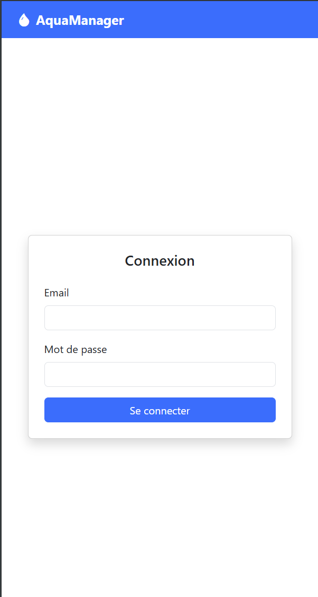
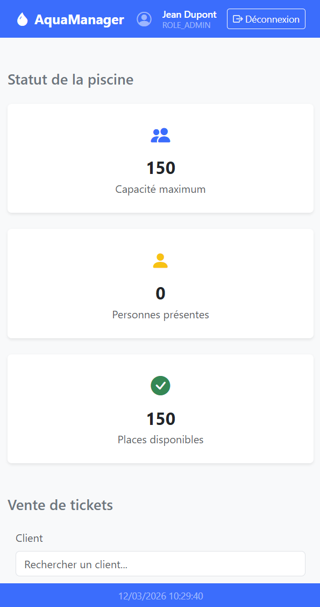
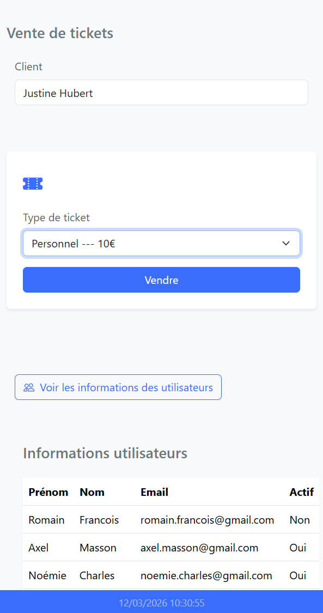
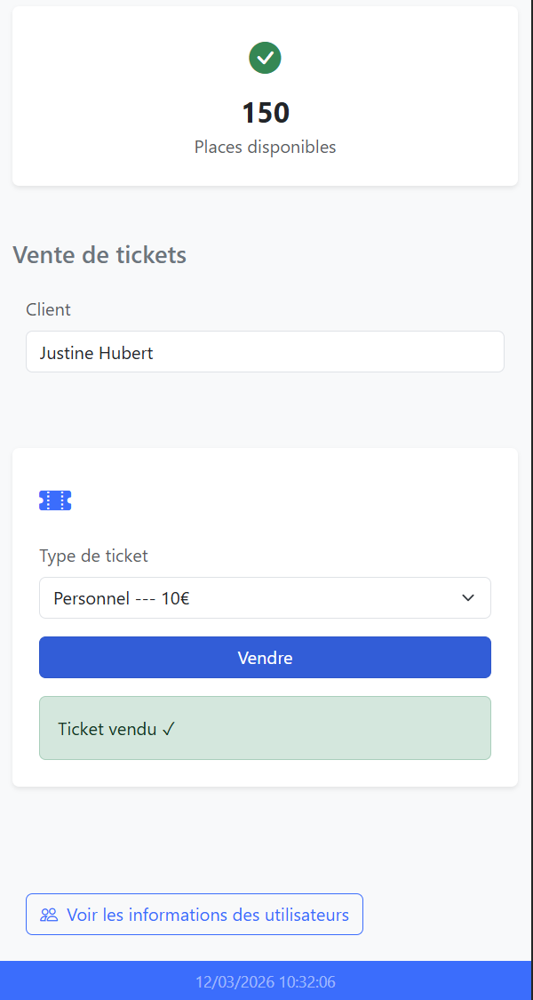

# pool-front

Interface web pour la gestion d'une piscine municipale. Frontend vanilla connecté à [pool-api](https://github.com/ThomasSchmidt1982/pool-api).

🌐 **Démo en ligne** : [https://pool-front.thomasschmidt.fr](https://pool-front.thomasschmidt.fr)

> ⚠️ L'API peut mettre quelques secondes à répondre lors de la première connexion (réveil du service Render).

---

## Aperçu

| Login                              | Dashboard avec statut piscine          |
|------------------------------------|----------------------------------------|
|            |      |
| Dashboard avec                     | Dashboard avec vente de ticket |
|  |      |

---

## Stack technique

- HTML / CSS / JavaScript (Vanilla)
- [Bootstrap 5.3](https://getbootstrap.com/) — UI
- [Bootstrap Icons 1.11](https://icons.getbootstrap.com/) — icônes
- Modules ES natifs (pas de bundler)

---

## Installation locale

```bash
git clone https://github.com/ThomasSchmidt1982/pool-front.git
cd pool-front
```

Ouvre `index.html` avec un serveur statique sur le port `5500` (Live Server, WebStorm...).

> Le port 5500 est requis — le CORS de pool-api est configuré pour cette origine.

L'URL de l'API est détectée automatiquement :
- En local → `http://localhost:8080`
- En prod → `https://pool-api-baic.onrender.com`

---

## Routes API consommées

| Méthode | Route | Rôle requis | Description |
|---------|-------|-------------|-------------|
| POST | `/auth/login` | — | Authentification, retourne un JWT |
| GET | `/pool/status` | ALL | Statut et capacité de la piscine |
| GET | `/users` | ADMIN | Liste des utilisateurs |
| GET | `/users/search?q=` | ADMIN, EMPLOYEE | Recherche d'un utilisateur |
| GET | `/employees` | ADMIN | Liste des employés |
| POST | `/users/{id}/tickets` | ADMIN, EMPLOYEE | Vente d'un ticket à un utilisateur |
| GET | `/tickets/kinds` | ADMIN, EMPLOYEE | Types de tickets disponibles |

---

## Authentification

Login via `POST /auth/login` → token JWT stocké en `localStorage`.  
Chaque requête inclut le header :

```
Authorization: Bearer <token>
```

Le rôle est extrait du payload JWT pour adapter l'interface :

| Rôle | Accès |
|------|-------|
| `ROLE_ADMIN` | Statut piscine, vente tickets, tableaux users/employés |
| `ROLE_EMPLOYEE` | Statut piscine, vente tickets |
| `ROLE_USER` | Statut piscine |

---

## Structure du projet

```
pool-front/
├── index.html
├── favicon.svg
├── docs/
│   ├── login.png
│   └── dashboard1.png
│   └── dashboard2.png
│   └── dashboard3.png
├── html/
│   └── dashboard.html
└── js/
    ├── config.js       ← URL API (détection auto local/prod)
    ├── auth.js         ← login / logout
    ├── utils.js        ← décodage JWT
    ├── dashboard.js    ← logique principale
    ├── router.js
    └── api.js
```
